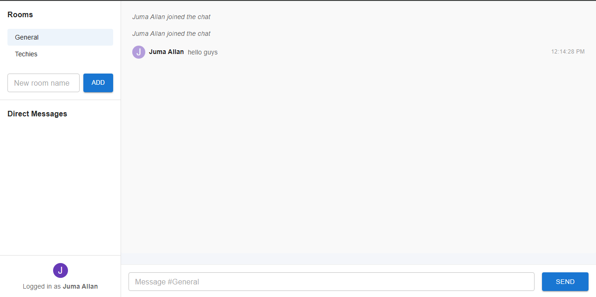

# Real-Time Chat Application with Socket.io & React (Material UI)

This project is a modern, full-featured real-time chat application built with Node.js, Express, Socket.io, and React (with Material UI for a professional look). It supports public chat rooms, private messaging, notifications, and more.

---

## 🚀 Features

- **Real-time messaging** using Socket.io
- **User authentication** (username-based)
- **Multiple chat rooms** (create, join, switch)
- **Private messaging** between users
- **In-app notifications** for new messages and private chats
- **Typing indicators**
- **Online user presence**
- **Modern, responsive UI** with Material UI
- **Unread message badges** for rooms and private chats

---

## 🛠️ Setup Instructions

### Prerequisites
- Node.js (v18 or higher)
- npm

### 1. Clone the repository
```sh
# In your terminal:
git clone <your-repo-url>
cd week-5-web-sockets-assignment-Mbitajeff
```

### 2. Install server dependencies
```sh
cd server
npm install
```

### 3. Install client dependencies
```sh
cd ../client
npm install
```

### 4. Start the development servers
- In one terminal, start the server:
  ```sh
  cd server
  npm run dev
  ```
- In another terminal, start the client:
  ```sh
  cd client
  npm run dev # or npx vite
  ```

### 5. Open the app
- Visit [http://localhost:5173/](http://localhost:5173/) in your browser.

---

## 🖥️ Screenshots



---

## ✨ Advanced Features Implemented
- Multiple chat rooms (create/join/switch)
- Private messaging with notification badges
- In-app notifications for new messages
- Typing indicators and online presence
- Modern Material UI design

---

## 📦 Project Structure

```
socketio-chat/
├── client/                 # React front-end
│   ├── public/             # Static files
│   ├── src/                # React source code
│   │   ├── components/     # UI components
│   │   ├── context/        # React context providers
│   │   ├── hooks/          # Custom React hooks
│   │   ├── pages/          # Page components
│   │   ├── socket/         # Socket.io client setup
│   │   └── App.jsx         # Main application component
│   └── package.json        # Client dependencies
├── server/                 # Node.js back-end
│   ├── config/             # Configuration files
│   ├── controllers/        # Socket event handlers
│   ├── models/             # Data models
│   ├── socket/             # Socket.io server setup
│   ├── utils/              # Utility functions
│   ├── server.js           # Main server file
│   └── package.json        # Server dependencies
└── README.md               # Project documentation
```

---

## 📚 Resources
- [Socket.io Documentation](https://socket.io/docs/v4/)
- [React Documentation](https://react.dev/)
- [Material UI Documentation](https://mui.com/)
- [Express.js Documentation](https://expressjs.com/)

---

## 📝 Submission
- Complete both the client and server portions of the application
- Implement the core and advanced chat features
- Add screenshots or GIFs above
- Push your code to GitHub Classroom
- (Optional) Deploy and add the deployed URLs here 